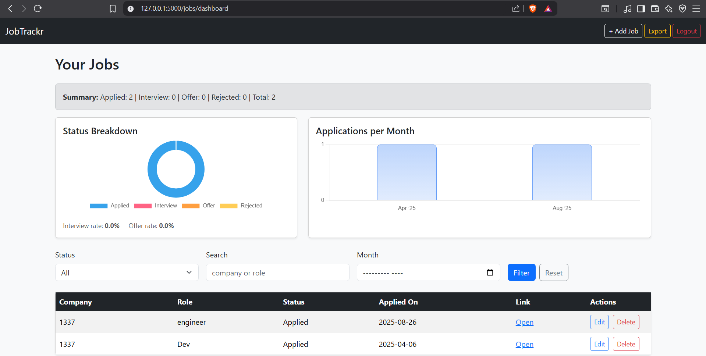
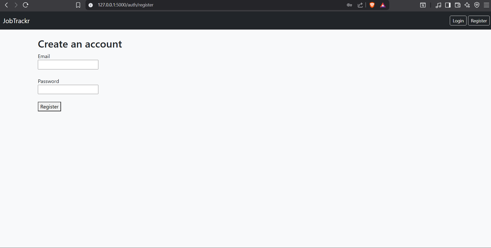

# JobTrackr


A full-stack job application tracker built with **Flask, SQLAlchemy, Bootstrap and Chart.js**.

JobTrackr allows users to register, manage their job applications, filter records, monitor application progress through analytics and export their data to CSV.

---

## Live Demo

[Try JobTrackr](https://wkratos77.pythonanywhere.com/)

Create an account, add job applications, explore the dashboard and test the filtering and analytics features.

---

## Features

### Authentication

* User registration
* Secure login and logout
* Password hashing with Werkzeug
* User-specific application data

### Job Application Management

* Add new job applications
* Edit existing applications
* Delete applications
* View applications in a structured dashboard
* Track company, position, status and application date

### Search and Filtering

* Search by keyword
* Filter applications by status
* Filter applications by application month
* Pagination for larger application lists

### Analytics

* Application status breakdown
* Monthly application activity
* Applied, interview, offer and rejection counters
* Interview and offer conversion rates
* Interactive charts powered by Chart.js

### Data Export

* Export application records to CSV
* Compatible with Excel and Google Sheets

### Interface

* Responsive Bootstrap 5 layout
* Dashboard cards and tables
* Flash messages and form validation
* Clean and accessible navigation

---

## Tech Stack

| Area                | Technology             |
| ------------------- | ---------------------- |
| Backend             | Python, Flask          |
| Database            | SQLite, SQLAlchemy     |
| Authentication      | Flask-Login, Werkzeug  |
| Database migrations | Flask-Migrate, Alembic |
| Templates           | Jinja2                 |
| Frontend            | HTML, CSS, Bootstrap 5 |
| Charts              | Chart.js               |
| Deployment          | PythonAnywhere         |

---

## Installation

### 1. Clone the repository

```bash
git clone https://github.com/wkratos/jobtrackr.git
cd jobtrackr
```

### 2. Create a virtual environment

Linux and macOS:

```bash
python3 -m venv .venv
source .venv/bin/activate
```

Windows PowerShell:

```powershell
python -m venv .venv
.venv\Scripts\Activate.ps1
```

Windows Command Prompt:

```cmd
python -m venv .venv
.venv\Scripts\activate.bat
```

### 3. Install the dependencies

```bash
pip install -r requirements.txt
```

### 4. Configure the environment

Create a `.env` file in the project root:

```env
FLASK_APP=app
FLASK_ENV=development
SECRET_KEY=replace-this-with-a-secure-secret-key
```

You can use `.env.example` as a reference.

### 5. Apply database migrations

```bash
flask --app app db upgrade
```

### 6. Start the application

```bash
flask --app app run --debug
```

Open:

```text
http://127.0.0.1:5000
```

---

## 📸 Screenshots

### Dashboard with Filters + Charts


### Add Job Form


### Login Form


### Register Form



## Project Structure

```text
jobtrackr/
├── app.py
├── config.py
├── extensions.py
├── models.py
├── routes/
│   ├── auth.py
│   ├── jobs.py
│   └── main.py
├── templates/
├── static/
├── migrations/
├── docs/
├── .env.example
├── .gitignore
├── Procfile
├── requirements.txt
└── README.md
```

* `app.py` creates and configures the Flask application.
* `config.py` contains application configuration.
* `extensions.py` initializes shared Flask extensions.
* `models.py` defines the database models.
* `routes/` separates authentication, job and main application routes.
* `templates/` contains Jinja2 templates.
* `static/` contains styles and other static resources.
* `migrations/` stores database migration history.

---

## Completed Milestones

* User authentication
* Complete job CRUD workflow
* Search and filtering
* Pagination
* Dashboard statistics
* Chart-based analytics
* CSV export
* Responsive interface
* Database migrations
* Online deployment

---

## Roadmap

* Email reminders for interviews
* Follow-up notifications
* Dark mode
* PostgreSQL production support
* More detailed conversion analytics
* Time-to-interview and time-to-offer statistics
* User profile customization
* Shared workspaces for teams
* Automated tests

---

## What I Learned

This project helped me improve my understanding of:

* Structuring a Flask application
* Separating routes using blueprints
* User authentication and session management
* Relational database modelling
* Database migrations
* CRUD operations
* Filtering and pagination
* Server-side form processing
* Data visualization
* CSV generation
* Deployment and environment configuration

---

## Author

**wkratos**

* GitHub: [@wkratos](https://github.com/wkratos)
* 42/1337 login: `wkratos`
